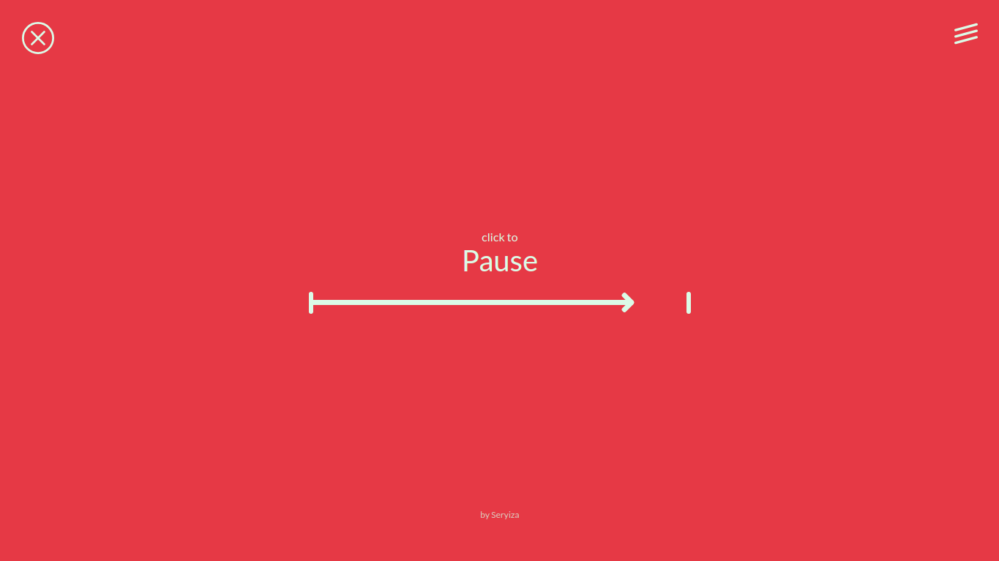

# - Tomato Rattle - Томатная Погремушка -
Мой небольшой проект (pet project) для практики на языке `JavaScript` и изучения интересных концепций.

## Ещё один таймер? Зачем?
Я преследую несколько целей:

* **Законченный проект.** Это помогает психологически и есть что показать для code review или обсуждения на собеседовании.
* **Изучение концепций Frontend.** Например, MVC и несколько независимых экранов приложения. Написание велосипедов даёт более глубокое понимание, чем просто чтение теории.
* **Сборка современного JS.** NPM, Babel, Parcel, ESLint. Придерживался минимума инструментов для баланса ~~(иначе можно с ума сойти)~~.

## Как я пишу код?
Велосипедами и рефакторингом. Стараюсь всегда держать в голове идею *"Не доверяй себе сейчас, в будущем требования могут поменяться. Делай проще сейчас, чтобы можно было проще изменить код потом"*.

Нет предела совершенству, поэтому **принимаю любую аргументированную критику** насчет кода и идей реализации.

## Как это выглядит?



## Круто! Можно попробовать?
```bash
$ npm run dev   # Starts Parcel in dev-mode
$ npm run build # Parcel builds my timer
```

## О звуках
Указываю авторов звуков-помидорок, используемых мною:
* [Piano Notification](https://freesound.org/people/FoolBoyMedia/sounds/352655/)
* [Mystery Peak](https://freesound.org/people/FoolBoyMedia/sounds/256098/)
* [Kaiandersen's Notification](https://freesound.org/people/KaiAndersen/sounds/435677/)
* [Thebuilder15's Notification](https://freesound.org/people/TheBuilder15/sounds/415762/)
* [Messenger Notification](https://freesound.org/people/Daphne_in_Wonderland/sounds/400697/)
* [Unfa Ping](https://freesound.org/people/shinephoenixstormcrow/sounds/337050/)
* [Xylo](https://freesound.org/people/Robinhood76/sounds/336713/)
